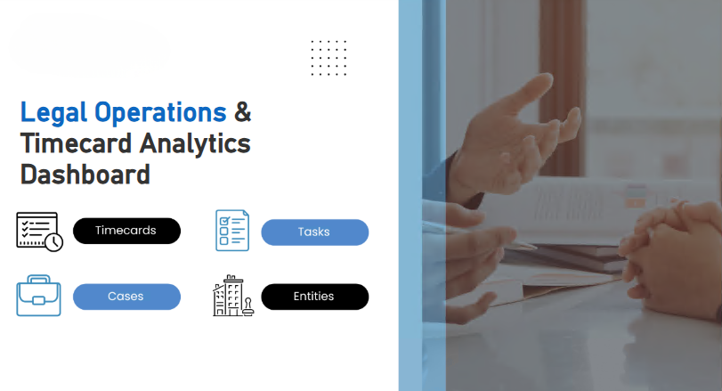
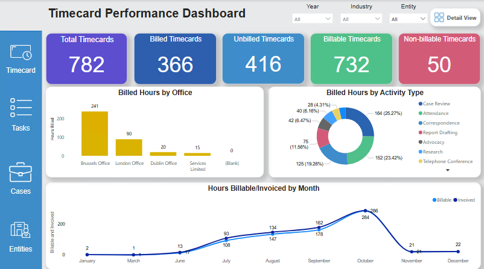
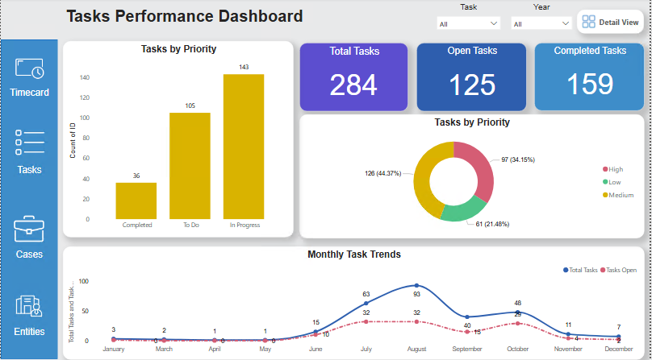
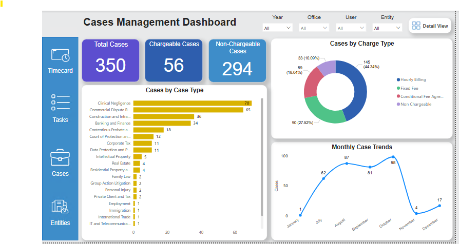
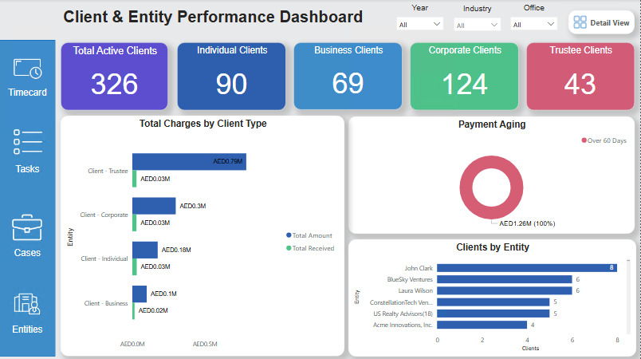

# ⚖️ Legal Analytics Dashboard

## 📌 Description

This project presents an interactive Power BI dashboard designed for legal and business analytics. It analyzes key metrics using SQL, DAX, and data modeling to provide actionable insights for decision-making.

## 🚀 Features

* Interactive dashboards
* KPI tracking and performance metrics
* Data-driven insights for legal operations
* Multiple dashboard views for analysis

## 🛠️ Tools Used

* Power BI
* DAX
* SQL
* Data Modeling

## 📈 Key Insights

* Identified trends in legal data and case performance
* Highlighted key performance indicators for decision-making
* Provided insights to improve operational efficiency

## 🖼️ Dashboard Preview

### Cover page

### Dashboard 1

### Dashboard 2

### Dashboard 3

### Dashboard 4

## 📂 Project File

* `Legal_Analytics_Dashboard.pbix` (Power BI file)

## 👩‍💻 Author

**Ansa Maqsood**
Aspiring Data Analyst | Power BI | SQL | Data Visualization
